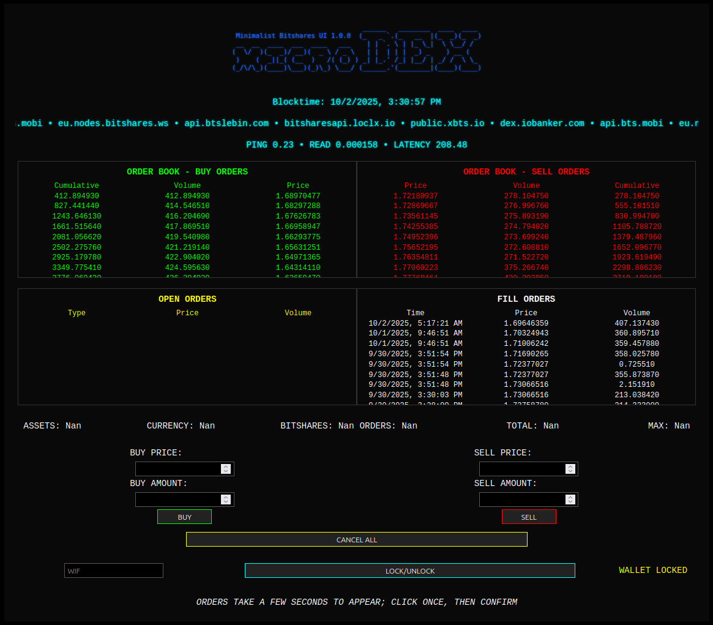

# microDEX - Minimalist BitShares UI 1.0.0

> A dependency-free, real-time trading interface for the BitShares blockchain - built with vanilla HTML, CSS, and JavaScript. No React. No Vue. No Tailwind. Just raw data, fast.



---

## What Is microDEX?

**microDEX** is a lightweight, minimalist web-based trading interface for the [BitShares](https://bitshares.org) blockchain. It streams live order book, fill history, and account data directly from multiple public BitShares nodes using **litepresence's metaNODE** backend, then pushes updates to your browser via a custom **ASGI WebSocket pipeline**.

No frameworks. No bloat. No dependencies. Pure performance.

---

## Features

- Realtime Order Book (Buy & Sell)
- Live Fill History
- Open Orders Tracker
- Buy/Sell Interface with Wallet Lock/Unlock
- Multi-Node Latency & Health Monitoring
- Vanilla HTML/CSS/JS - Zero External Libraries
- ASGI WebSocket Backend for Low-Latency Streaming
- Built on litepresence's metaNODE for Reliable Blockchain Data

---

## Data Displayed

| Section             | Info Shown                                                                 |
|---------------------|----------------------------------------------------------------------------|
| **Blocktime**       | Current blockchain timestamp                                               |
| **PING / READ / LATENCY** | Network health metrics across connected nodes                            |
| **Order Book**      | Cumulative volume, price, and volume per level (buy/sell)                  |
| **Open Orders**     | Type, Price, Volume of your active orders                                  |
| **Fill Orders**     | Timestamp, Price, Volume of recent fills                                   |
| **Wallet Status**   | Locked/Unlocked state + WIF input field                                    |
| **Trade Controls**  | Buy/Sell price & amount fields + "BUY", "SELL", "CANCEL ALL" buttons       |

---

## How It Works

1. **Backend**: The `metaNODE` connects to multiple BitShares API nodes, aggregates data, and pushes it via ASGI WebSockets.
2. **Frontend**: Vanilla JS listens to WebSocket events and dynamically updates the DOM - no virtual DOM, no reactivity engine.
3. **UI**: Hand-coded CSS with dark theme, monospace fonts, and terminal-style layout for clarity and speed.

---

## 🛠️ Setup & Run

### Prerequisites

- Python 3.8+  (preferably in a virtual environment)

### Installation

```bash
git clone https://github.com/squidKid-deluxe/microDEX.git
cd microDEX
pip install -r requirements.txt
```

### Start Backend

```bash
python serve_metanode.py
```

Then open `microDEX.html` in your browser; I tested with Firefox, but it should work on Chrome and Safari too.

> *Note: If you do not run the ASGI backend first, you will have to refresh the web page so the frontend can connect to the WebSocket.*

---

## Wallet & Trading

- **WIF Input**: Enter your private key (WIF format) to unlock wallet.  This never leaves your browser, and is only ever handled client-side.
- **Lock/Unlock**: Toggle wallet state safely.  Once locked, your WIF is deleted from memory as well as JavaScript allows.
- **Place Orders**: Enter price and amount → Click "BUY" or "SELL".
- **Cancel All**: Cancel all open orders at once.
- ⚠️ **Orders take a few seconds to appear - click once, then confirm.**

---

## Nodes in Use (as shown in UI)

The app currently connects to these public BitShares API endpoints:

```
api.bts.mobi/wss
api.61bts.com/ws
api.dex.trading/ws
api.btslebin.com/ws
bitsharesapi.loclx.io
cloud.xbts.io/ws
node.xbts.io/wss
public.xbts.io/ws
dex.iobanker.com/ws
eu.nodes.bitshares.ws/ws
btsws.roelandp.nl/ws
```

You can customize this list in `metaNODE.py`, in the `public_nodes` function.

---

## Why No Frameworks?

Dependencies.  The bitshares reference UI is an amazing piece of software, but it has to be run with React 16, six whole major versions how out date.  My goal with this project, and others like the [DEX UX](https://github.com/squidKid-deluxe/bitshares-dex-ux), is to create software that depends on basics, without having to keep up with version cycles.  Using Python is bad enough, I remember 5 years ago python2.7 was not that old - now it's officially past support, and while it still works, even installing it on modern systems is difficult.  Vanilla JavaScript hasn't fundamentally changed for 30 years - *that* is stable.

---

## Contributing

PRs welcome! Much of this app is still up in the air, but feel free to contribute anyway.

---

## License

WTFPL - Do what you want.  It's open source, after all.

---

## Credits

- Built using the [metaNODE](https://github.com/litepresence/extinction-event/blob/master/EV/metaNODE.py) from litepresence's extinction-event.
- Inspired by the ethos of minimalism and decentralization
- For the BitShares community - keep building!
